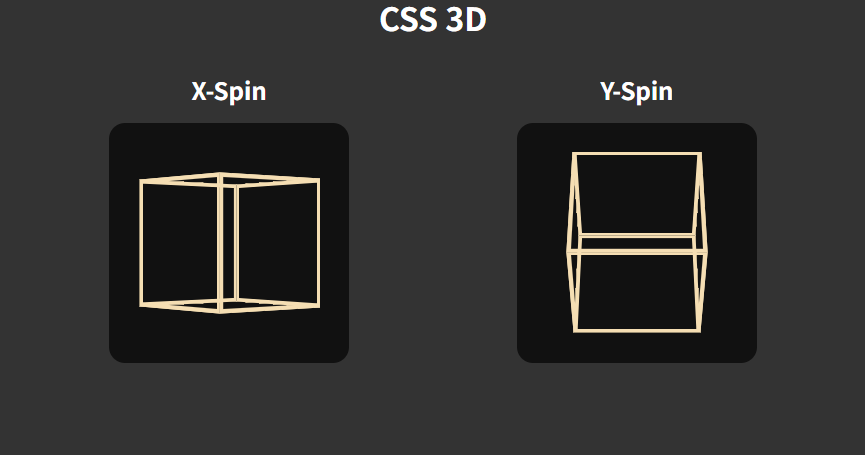

# CSS 3D

A small demo showing simple CSS 3D cubes with X/Y spin animations, built with Vite.

## Features

- Two 3D cubes implemented with pure CSS and HTML.

## License

This project is open-source and available under the MIT License.
